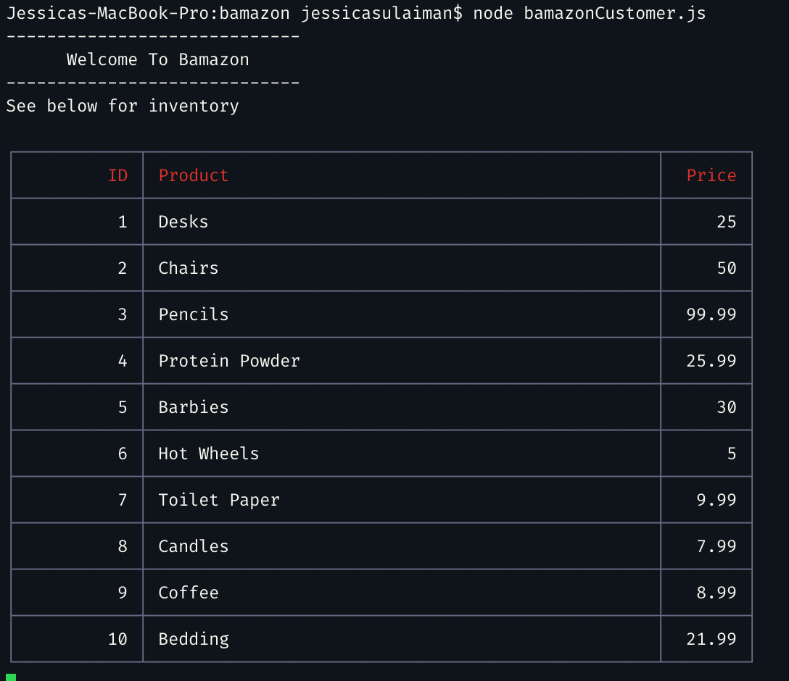

# bamazon

## About 
This is a Amazon-like store front on the command line using Node and MySQL. Bamazon will take in orders from customers and deplete stock from the store's inventory. 

By running this node application we will see all the items for sale. The app prompts users with two messages. 
* First, the app asks them the ID of the product they would like to buy. 
*Second, the app asks how many units of the product they would like to buy.

Next, once the customer has placed the order, the application will check if my store has enough of the product to meet the customer's request. If there's not enough of the product the app will log 'Insufficient quantity!' thus prevents the order from going through.

If the store has enough of the product it will fulfill the customer's order. Which means the SQL database will be updated to reflect the remaining quantity. Once the update goes through, it will show the customer the total cost of their purchase.

## Technologies Used:
* MySQL
* JavaScript
* Node

## NPM Packages:
* MySQL
* Inquirer 
* CLI Table2 (updated version) for rendering tables on the command line from node.js scripts.

# Screenshots
Here is the table made from mysql and ran with node and mysql npm package on the command line:

Here is the table of items in my store. It's a small store, please don't judge. 

I'm prompting the user with a question:
